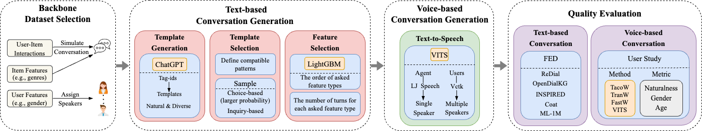

<div align="center">
  <a href="https://github.com/hyllll/VCRS">
    
  </a>

  <h3 align="center">Voice-based Conversational Recommender Systems</h3>

  <p align="center">
    <a href="https://arxiv.org/abs/2306.08219"> Towards Building Voice-based Conversational Recommender Systems: Datasets, Potential Solutions, and Prospects </a>
  </p>
</div>

<details>
  <summary>Table of Contents</summary>
  <ol>
    <li>
      <a href="#about-the-project">About The Project</a>
    </li>
    <li>
      <a href="#dataset-description">Dataset Description</a>
    </li>
    <li><a href="#potential-solution-exploration">Potential Solution Exploration</a></li>
    <li><a href="#data-construction">Data Construction</a></li>
    <li><a href="#contributing">Contributing</a></li>
    <li><a href="#acknowledgement">Acknowledgement</a></li>
  </ol>
</details>

# About The Project
This project is the code of paper "[Towards Building Voice-based Conversational Recommender Systems: Datasets, Potential Solutions, and Prospects](https://arxiv.org/abs/2306.08219)". In this project, we aim to provide two voice-based conversational recommender systems datasets in the e-commerce and movie domains.


# Dataset Description
You can download datasets from GoogleDrive. The datasets consist of two parts: [coat.tar.gz](https://drive.google.com/file/d/1FnpYhMaeskckxGheKjar0U4YHIdDKM6K/view?usp=share_link) and [ml-1m.tar.gz](https://drive.google.com/file/d/195ugsUrU51VMUjjI329M84qegtK2QuGC/view?usp=sharing)

## Dataset files
The data file is formatted as a mp3 file and the file name form is `diaidxx_uidxx_iidxx_xx_xx_xx.mp3`.

For example, for file `diaid21_uid249_iid35_20-30_men_251.mp3`, its meaning is as follows:
```
diaid21: corresponds to dialogue 21 in the text-based conversation dataset
uid249: user id is 249
iid35: item id is 35
20-30: user's age is between 20 and 30
men: user's gender is male
251: corresponds to speaker p251 in vctk dataset
```
Speaker information on the vctk dataset can be found [here](www.udialogue.org/download/cstr-vctk-corpus.html)

## Case study
Here we provide a demo of a data file (i.e., `diaid21_uid249_iid35_20-30_men_251.mp3`) that contains text and audio dialogue between the user and the agent. 

https://user-images.githubusercontent.com/38367896/221455311-06c8ef5b-b873-4aab-9fdc-3c274908bbee.mp4


Note that since we currently only explore the impact of speech on VCRS from the user's perspective, only the user's speech is included in the provided dataset. If you want complete dialogue audio, you can generate it through the code we provide.

# Potential Solution Exploration
We propose to extract explicit semantic features from the voice data and then incorporate them into the recommendation model in a two-phase fusion manner.

Please refer to [here](https://github.com/hyllll/VCRS/tree/main/Recommender) for how to run the code.

# Data Construction
Our VCRSs dataset creation task includes four steps: (1) backbone dataset selection; (2)text-based conversation generation; (3) voice-based conversation generation; and (4) quality evaluation.
<br>
<p align="center">
  
  <br>
</p>
<br>

## Backbone dataset selection
We choose [Coat](www.cs.cornell.edu/~schnabts/mnar/) and [ML-1M](grouplens.org/datasets/movielens/1m/) as our backbone datasets. Using user-item interactions and item features to simulate a text-based conversation between users and agents for recommendation and using user features to assign proper speakers.

## Text-based conversation generation
Please refer to [here](https://github.com/hyllll/VCRS/tree/main/Dialogue) for how to generate the text-based conversation and the code is in `./Dialogue/` directory.

## Voice-based conversation generation
Please refer to [here](https://github.com/hyllll/VCRS/tree/main/Speech) for how to generate the voice-based conversation.

## Quality evaluation
We adopt the fine-grained evaluation of dialogue (FED) metric to measure the quality of the generated text-based conversation.
### Installtion
```
pip install -r requirements.txt
```
### RUN
1. ```cd ./Evaluate/```
2. ``` python evaluate.py --dataset='xxx'```, ```xxx``` is ```coat``` or ```ml-1m```.
3. All results are saved in `./res/` directory.


# Acknowledgement
* Convert text to audio using [VITS](https://github.com/jaywalnut310/vits), a SOTA end-to-end text-to-speech (TTS) model.

* Improve code efficiency by [conv_rec_sys](https://github.com/xxkkrr/conv_rec_sys).

* Evaluate text-based conversation with [Fed](https://github.com/exe1023/DialEvalMetrics).